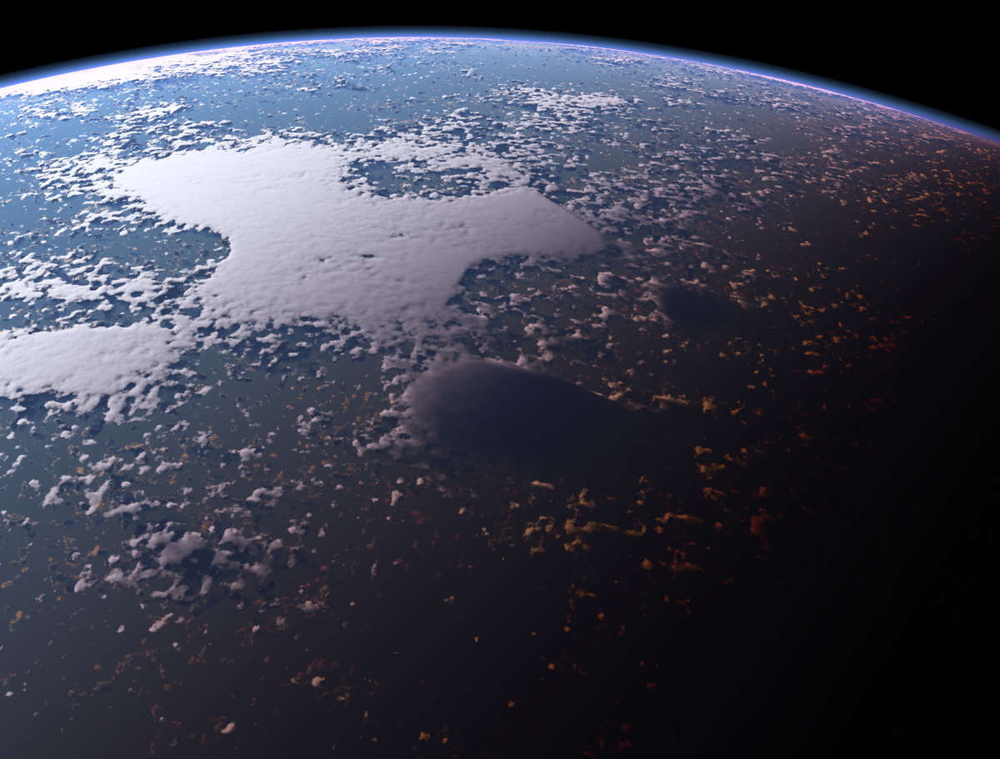

# Realistic Atmosphere

A standalone application for rendering procedural planetary images on the GPU.

Can use both realtime and offline raytracing/pathtracing (RT/PT) + raymarching (RM).

[Link to the thesis](thesis.pdf)

## Features
- Atmospheric scattering (RM)
    - Volumetric light
- Cloud precipitation (RM)
- Procedural terrain (RM, RT/PT for shadows)
    - RM for accelerated soft shadows
- Procedural objects (spheres & cubes) (RT/PT)
    - Only diffuse material
- View from any location (including the space)
- Real physical properties
    - Color correction (Radiance ➡ Luminance)
    - Cloud scattering function
        - Based on real measurements
- Optimizations
    - Light shafts approximation
- Configurable output image size
    - PNG output format
    - Tiled rendering (for lower-end devices)

## Implementation
- BGFX framework limited to OpenGL backend
- Raw GLSL used in (mainly compute) shaders
- GLM for algebraic calculations
- SDL for input

## Build
Use 64-bit Visual Studio 2022 with MSVC v143 C++ workload and Windows 10 SDK 10.0.19041.0.

### Hardware requirements
Tested on GeForce GTX 1050 Mobile and Intel UHD Graphics 630.

## Screenshots

